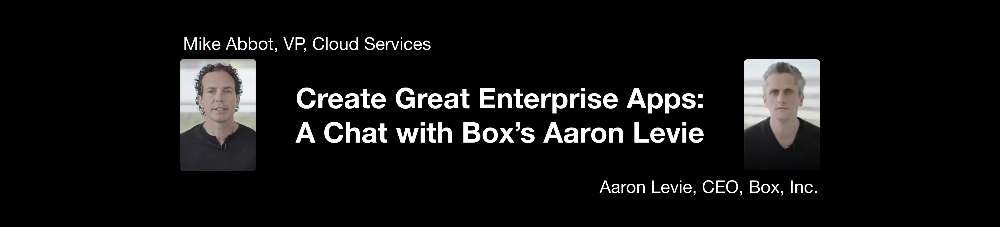

[[toc]]

## 引言

对于一家企业来说其商业环境是不断地在变化的，尤其在疫情期间，企业会面临前所未有的艰难挑战。对此，一个强大的企业应用无疑是企业适应远程办公环境，突破困难更进一步的重要支撑。在此次 WWDC 2020 中，苹果云服务副总裁 [Mike Abbott](https://en.wikipedia.org/wiki/Mike_Abbott) 与 Box 公司 CEO 兼联合创始人 [Aaron Levie](https://en.wikipedia.org/wiki/Aaron_Levie) 进行了一场关于当今工作环境的交流，分享了如何让基于云计算的应用协助员工远程办公，并在严峻的环境中取得创新。

## 快马加鞭的数字化转型战略

亚伦提到，新冠疫情的产生加快了公司的数字化转型战略，这种转型本来在某些情况下需要数年或十年。他举了一个 Box 公司的例子，是一个提高程序性能的项目。以之前认为的生产力创造力来说，应该在办公室白板上的不同会议中，将有 5、10、15 个人专门从事该项目。而现在是一个虚拟的环境，有 100 个人在 Slack Channel 中对如何在整个应用程序中达到亚秒级延迟提出了他们的想法，这横跨了所有不同部门和团队。员工可能之前不是性能工程师，但他也会提出自己的想法为这个项目作出贡献。这是数字化转型的体现。

## 未来是一个混合环境，云技术是关键

亚伦认为，未来是一个物理世界和虚拟世界的混合环境，而办公室将会在其中扮演重要角色。这将会为人们的工作方式带来更大的灵活性和敏捷性，从而为人们提供更多选择，并使他们在任何地方都能提高工作效率。而云技术是创建混合环境的能力的重点，他们的目标就是更为最佳的云服务商。

> 我们认为，在未来，数字化的工作场所将成为连接物理世界和虚拟世界的桥梁。这两个世界的中心是一个现代数字化工作场所。
>
> 在这个数字化工作场所中，我们需要现代技术来完成我们的工作。
>
> 我们需要拥有 MacBooks，iPhone 和 iPad 等现代设备。
>
> 我们需要能够使用现代且安全的网络。
>
> 我们需要能够保护我们的身份不受云影响，以便我们可以在任何地方工作。
>
> 我们需要实时协作。
>
> 我们需要能够进行视频通话，无论是用 Webex、Zoom 或 Google Hangouts。
>
> 我们需要能够在 Slack 等产品上聊天和交流。
>
> 而我们在 Box 的工作是，我们希望能提供一种最佳的方法来去以这种远程和分布式工作方式安全地管理内容。无论何时你想要访问文件，无论何时你与你的合作伙伴，同事以及企业内外的人员安全地共享文件，我们都希望成为做到这一点的最佳云端。

他认为有两大支柱需要去考虑，一个是在新的分布式环境中实现协作和现代工作，另一方面是未来数字化的业务流程的数量。

> 我们考虑的是两大支柱。第一个是如何在这种新的分布式环境中实现协作和现代工作，在这种新环境中你可以去办公室或可以随时随地工作？这就带来了技术，产品和服务，例如实时协作能力。
>
> 我们正在使用我们最新版本的 iPad 应用程序工作，该版本将支持 Apple Pencil，因此你将能够在文档上进行实时注释，并确保这些注释可以被网上或桌面上需要与你合作的其他人看到。我们正在研究全新的方法，以便能够以非常无缝的方式安全地在移动设备上共享内容。因此，我们为帮助远程工作人员能够以这种现代方式工作而带来的创新感到非常激动。
>
> 同时，我们也为即将到来的未来工作数字化的业务流程数量感到非常兴奋。那是各种各样的东西，从银行到医疗保健再到教育再到生命科学等等。这就是我们调整策略的方式，以确保我们现在可以帮助支持客户。

## 像消费者一样思考，提供消费级体验

亚伦和迈克都认为，企业产品需要消费者思维来提供消费者级的体验。

### 以最无缝的方式安全地进行协作

> 我们可能会有这种感觉——“企业软件又慢又复杂，因为这是企业软件。”然而这个想法在21世纪是毫无意义的。

亚伦认为生活中的消费级技术之间是存在联系的，无论是 MacBook 还是 iPhone 等设备，以及云服务和企业环境所需要的安全性。

> 我们的愿景是，无论你是使用 MacBook 还是希望能够在 iOS 设备上安全地进行协作，我们都希望以最无缝的方式完成工作。

在设计应用程序的方式方面，Box 公司采用 iOS 优先的策略，以确保最佳的用户体验，并从根本上将其视为消费级体验。

> 我们如何将消费者级的体验带入企业中，这样人们无论在哪里工作，都不必担心正常情况下可能会遇到的所有复杂性，所有支持以及在一个正常的 IT 环境中你不得不需要去面对的所有挑战？这实在是需要消费者级的解决方案才能启用这种新的工作方式。

他认为在企业中应该让每一小个体验都能匹配并赶上日常生活中的体验。

### 零接触部署和控制更新

对迈克来说，如何将消费者 DNA 和这种消费者思维带入企业产品，需要考虑两件事情。一个是用 [Apple Business Manager](https://developer.apple.com/videos/play/wwdc2020/10667/) 进行零接触 Mac 部署。这样就能提升自动进给能力来允许组织订购计算机。一批计算机到了，他们可以立即将其插入电源，这样该员工基本上就可以立即正常工作了。第二点是控制更新，以及企业中确实存在的一些独特的需求，何时做何时不做？还要明白企业实际迭代的速度与消费者空间有所不同。

## 思考一个移动优先、数字优先的世界

> 我们知道这些是人们想要的工作方式。人们希望能快速地加载 iPhone，保证他们能够以一个非常无缝的方式来使用这些应用。我在家办公时花在 iPhone 上的时间比电脑更多。这是因为在某些情况下，当你使用 iPad 或 iPhone 时，交流，聊天和协作以及观看视频和打开文档会变得更加容易。因此，我们希望能够确保我们提供了出色的体验。

### 更深的互操作性

亚伦认为有很多事情都需要围绕更深的互操作性以及更无缝的体验。随着越来越多的数据转移到云中，所有企业软件开发人员理应创建一定程度的互操作性，以便客户可以选择，从而获得综合的体验。

### 面向微服务

> 从根本上来说，我认为你必须面向微服务，因为事实上有太多功能需要交付给客户。由于世界瞬息万变，我们必须能够交付不断为客户更新的创新产品。因此，我们对发版的看法是我们不会考虑季度或几年的发版，因为在 5 或 10 或 20 年前你可能会使用传统的企业软件。我们每天都在考虑发布，我们不仅在传送将更新在人们 iOS 设备上的本地代码时考虑发布，而且还在考虑在后台实现的云服务。对我们的客户而言，我们的软件更好，更快，更简单，更轻松，更安全吗？真正做到这一点的唯一方法是拥有现代架构。如果可以在微服务之上运行。如果可以分离出应用程序的核心组件。如果可以确保你正在进行持续的开发和集成。所有这些都是现代开发企业软件的基础。

### 从杠杆率高的业务开始

亚伦认为任何大型企业都有一种双重性，他们想去创造的很多现代体验，但同时，他们又拥有许多传统基础架构，传统流程。

因此，他的大致观点是从业务中一些杠杆率最高的部分开始的，比如一些接触终端用户，员工，客户的事物。真正地从这里开始，并确保专注于这些类型的用户体验。

## 要考虑产品的内置安全性

亚伦认为，对于一款企业产品，其内置的安全性也尤为重要。

> 我们知道，世界正在应对围绕数据安全性，网络安全性和数据隐私的巨大挑战。因此，请确保我们构建的软件在内核中内置了安全性和数据隐私。这是使我们为企业创建的所有应用程序与众不同的地方。这是我们切实可行地为医院和政府机构，生命科学组织，银行，大学，K-12 教育等服务的唯一途径。

### 安全性不是别人的事

亚伦认为，安全性是每一个现代企业软件开发人员需要具备的意识。

> 过去，如果你是软件开发人员，则认为处理数据安全性是别人的工作。它是设备，或是网络提供商，或是安全技术供应商。但在 21 世纪并非如此。如果你要为企业开发软件，必须将安全性融入到你所做的每件事和处理数据的每一种方式中。

### 利用苹果生态

亚伦推荐使用 Apple 生态来保证企业产品的安全性。他认为，从硬件方面为用户和开发人员提供Apple设备是最基本的，他对 iOS 的加密功能和Mac的安全性十分具有信心。同时，也在软件方面去利用本地的API，以及苹果提供的核心体验，比如 MDM 技术。

> 我认为，Apple 在该生态系统中已经明显成为了极好的合作伙伴。苹果可能单枪匹马地做了很多工作来使人们对企业软件的思想现代化，特别是因为 iOS 设备导致业界说：“等等。为什么我们在业务环境中必须拥有不良技术？为什么我们不能使用 MacBook？为什么我们不能使用 iPhone？为什么我们不能使用 iPad？” 这引起了人们对于我们为客户开发和构建的软件的不同层次的思考，我认为这是一个巨大的福音。

## 客户端服务器体系结构的新时代

亚伦认为如今是客户端服务端体系结构的新时代。云技术的提升让以前的不可能变成了可能。也有想 [Core ML](https://developer.apple.com/videos/play/wwdc2020/10152/) 这样的技术利用设备的处理能力进行设备级机器学习。这时候需要考虑的是，将什么逻辑放在云端？将什么逻辑放在设备上？如何利用这些设备的本身特性？如何保证设备的安全性和隐私权？什么属于最终用户级别？等等。

> 我认为所有软件开发人员都应当清楚该体系结构，因为这并不是十年前设备处理速度很慢时可能会做的事情，也许当时他们没有那么多的计算能力，也没有 Core ML。当你可以利用的所有新服务时，你不会想像十年前的今天那样设计事物。

## 下一个Slacks和Zooms时代

亚伦认为将会有一波创新浪潮，它将重新构想同步工作和异步工作的结合。他认为对于大型企业和创业公司的软件开发人员来说，现在是一个令人惊奇的机会，他们可以开始考虑工作的新特性。提供现代数字工作场所的方式，无论是在视频中，还是在文档中，还是在聊天中，还是在其他共享知识的方式中，都能使人们在同一页面上。有了这种崭新的工作方式，许多公司就会脱颖而出，引领着下一个 Slacks 和 Zooms 时代。

## 附录：对话译文

迈克·阿博特（Mike Abbott）：嗨。今天，我们将讨论使用 Apple 技术创建出色的企业应用程序。与我一起的是 Box 的创始人兼首席执行官亚伦·列维。欢迎你，亚伦。

亚伦·列维（Aaron Levie）：嘿，迈克。很高兴来到这里。

迈克：当下是一个非常非常有趣的时刻，有远程办公，新冠病毒，以及其他一些相关的东西。亚伦，关于我们正在进入的这个新世界，你从客户那里都听到了什么呢？

亚伦：显然，这是人们在全球各种规模的组织中的工作方式的一种完全转变，是由一场令人难以置信的悲剧性和艰巨的事件所带来的。它对医疗保健和经济产生了巨大影响。但是真正的结果是促使公司不得不加快其数字化转型战略，这种转型在某些情况下甚至需要数年或十年。

一个例子是 Box 正在进行一个的项目，它的目的是提高应用程序的性能。因此，我们希望不论身在何处，也不论是在网上还是在手机上，应用程序的每个部分都能在不到一秒钟的时间内运行。通常是，在办公室白板上的不同会议中，将有 5、10、15 个人从事该项目。这是我们本来认为的生产力。这是我们本来认为的创造力和协作能力。而现在我们正处于一个虚拟环境中，我们在 Slack Channel 中有 100 个人对如何在整个应用程序中达到亚秒级延迟提出了他们的想法。因此，我们现在可以囊括来自所有不同部门，所有不同团队的人员。之前不认为自己是个性能工程师的员工现在可以通过这种方式来为有力的更新和重要的升级作出贡献。

我认为如今的数字化转换存在着很多机会，并也很高兴与你交流。显然，苹果在这一领域如此重要，能够来到这里真是太好了。坦率地说，我个人也很好奇你们在这种大环境下是怎么做的。

迈克：当然，就说一件我们正在关注的事情，尤其是现在这种远程工作环境中，是大量使用 Mac 的公司，像 IBM  和 Oracle，都十分希望使用 Apple Business Manager 进行零接触部署，以便他们可以将这些设备运送给新老员工。这一切都是为他们准备的。

所以我认为我们正在看到一个总体趋势，是我们如何真正使远程工作者在我们所有设备，我们所有产品上的整体效率更高？因此，在我们所处的这个一去不复返的新世界中，Box 在产品侧做了什么改进来实现这一目标？

亚伦：我们认为，未来是一个混合环境，而我们的办公室将会在其中扮演重要角色。同时，这将会为我们的工作方式带来更大的灵活性和敏捷性，从而为人们提供更多选择，并使他们在任何地方都能提高工作效率。因此，对于如何创建混合环境的能力使我们可以从办公室或其他任何地方工作，云技术是重点。

我们认为，在未来，数字化的工作场所将成为连接物理世界和虚拟世界的桥梁。这两个世界的中心是一个现代数字化工作场所。

在这个数字化工作场所中，我们需要现代技术来完成我们的工作。

我们需要拥有 MacBooks，iPhone 和 iPad 等现代设备。

我们需要能够使用现代且安全的网络。

我们需要能够保护我们的身份不受云影响，以便我们可以在任何地方工作。

我们需要实时协作。

我们需要能够进行视频通话，无论是用 Webex、Zoom 或 Google Hangouts。

我们需要能够在 Slack 等产品上聊天和交流。

而我们在 Box 的工作是，我们希望能提供一种最佳的方法来去以这种远程和分布式工作方式安全地管理内容。无论何时你想要访问文件，无论何时你与你的合作伙伴，同事以及企业内外的人员安全地共享文件，我们都希望成为做到这一点的最佳云端。

幸运的是，我们与全球近 100, 000 个客户合作。我们在《财富》500 强中占 70％ 的份额。而且，我们有许多出色的组织正在努力使这种新的数字化工作方式成为可能。收到消息通知的时候，你随时可以到一台崭新的 MacBook 或到 iPad 上查看，并能够以非常安全的方式访问企业中可以访问的所有数据，并能够与重要人员安全地协作和共享你的业务。因此，我们确实调整了路线图和策略，以帮助客户处理这些远程工作案例，从而真正能够帮助客户在业务中推动数字化转型到一个新的水准。

我们考虑的是两大支柱。第一个是如何在这种新的分布式环境中实现协作和现代工作，在这种新环境中你可以去办公室或可以随时随地工作？这就带来了技术，产品和服务，例如实时协作能力。

我们正在使用我们最新版本的 iPad 应用程序工作，该版本将支持 Apple Pencil，因此你将能够在文档上进行实时注释，并确保这些注释可以被网上或桌面上需要与你合作的其他人看到。我们正在研究全新的方法，以便能够以非常无缝的方式安全地在移动设备上共享内容。因此，我们为帮助远程工作人员能够以这种现代方式工作而带来的创新感到非常激动。

同时，我们也为即将到来的未来工作数字化的业务流程数量感到非常兴奋。那是各种各样的东西，从银行到医疗保健再到教育再到生命科学等等。这就是我们调整策略的方式，以确保我们现在可以帮助支持客户。

迈克：在这种策略下，你是否可以详细说明一下苹果技术，以及你在业务中的想法以及客户的想法？

亚伦：从根本上讲，我们认为我们个人生活中已经习惯了的消费级技术之间是存在联系的，无论是 MacBook 还是 iPhone 等设备，以及云服务和我们企业环境所需要的安全性。

显然，这确实是 Box 之类的产品的切入点。这也是我们在所有 Apple 产品，所有核心平台上构建的东西。我们的愿景是，无论你是使用 MacBook 还是希望能够在 iOS 设备上安全地进行协作，我们都希望以最无缝的方式完成工作。在设计应用程序的方式方面，我们确保采用 iOS 优先的策略，以确保我们利用最佳的用户体验。并再次，从根本上将其视为消费级体验。

我们如何将消费者级的体验带入企业中，这样人们无论在哪里工作，都不必担心正常情况下可能会遇到的所有复杂性，所有支持以及在一个正常的 IT 环境中你不得不需要去面对的所有挑战？这实在是需要消费者级的解决方案才能启用这种新的工作方式。

迈克：我认为这就是我们的公司如此出色地合作的原因之一，因为我们非常关注消费者。显然，我们也将重点放在新兴的企业上。但是我们希望将产品中的这种消费者 DNA 和这种消费者思维带入企业产品。因此，如果我考虑我们现在要去做的事情，那么我将会扩展零接触 Mac 部署。自动进给方面会得以扩展来允许组织订购计算机。一批计算机到了，他们可以立即将其插入电源，这样该员工基本上就可以立即正常工作了。然后也要意识到企业中确实存在的一些独特的需求，例如更新。要能够控制更新：何时发生和何时不发生。还要明白企业实际迭代的速度与消费者空间有所不同。

亚伦：这是一个个人的例子。当我们第一次进入远程工作环境时，即便在 Box，我们也只有 2000 名员工，所以对我们来说更容易，也更顺畅。我记得当我需要设置新的 iMac 来确保拥有正确的视频设置和正确的环境时，从启动全新的计算机到访问我们业务中的每个关键应用程序大概花了五分钟的时间，并能够安全地与所有我需要的人员工作。

能够在任何设备上的云中无缝工作，能够在任何环境中工作并立即重新启动计算机所需的技术，这就是未来技术消费化力量的展现。因此，我们对此感到非常兴奋。

同时，作为这些产品的个人用户，我可以亲眼看到它可以在一台新设备上在5分钟内从零到一建好整个IT堆栈。那就是工作的未来。

迈克：如果你想给听众，或者说倾听中的企业提供指导。关于他们如何更好地应对迅速变化的形势，你能提供什么样的指导呢？

亚伦：我想无论哪个行业，我们都可以在各个领域看到这一点。我认为这是数字化转型的催化剂，它将加速可能落后两年，三年，五年，十年的项目。然后事物开始流转。这些项目将在未来几个月和几个季度中被执行。

我个人认为，这是信息技术或开发企业软件的开发人员有史以来最好的时光之一，因为每个企业都必须为员工和客户重写其基础流程和经验。

如果你思考[向后工作](https://www.allthingsdistributed.com/2006/11/working_backwards.html)，与其去研究 20 世纪发展起来的业务流程然后想：“数字世界会是什么样？” ，而是说我们现在有一个从零开始的机会，并想：“在 21 世纪，当你真正可以做到向后工作时，会是什么体验？将来提供教育的正确方法是什么？将来提供医疗保健的正确方法是什么？如果你是一家银行，并且希望能够自动化他们的入职流程并确保他们将来不必再向你发送纸张或签名，那么为客户提供服务的正确方法是什么？”我认为开发人员将能够转变工作以及许多企业体验的未来。

因此，我认为首先想到的几件事就是像消费者一样思考。在为企业开发软件时，首先要考虑消费者。

我们都是生活中的消费者，但不知怎么的，当我们去办公室时，我们有些放弃了提供消费者级体验的想法。我们可能会有这种感觉——“企业软件慢又复杂，因为这是企业软件。”然而这个想法在21世纪是毫无意义的。在企业中我们应该让每一小个体验都能匹配并跟上我们日常生活中的体验。这是第一点。

第二点是，我们要思考一个移动优先、数字优先的世界。当你考虑各种需要部署的产品时，当你考虑各种创造出来的用户体验时，我们知道这些是人们想要的工作方式。人们希望能快速地加载 iPhone，保证他们能够以一个非常无缝的方式来使用这些应用。我在家办公时花在 iPhone 上的时间比电脑更多。这是因为在某些情况下，当你使用 iPad 或 iPhone 时，交流，聊天和协作以及观看视频和打开文档会变得更加容易。因此，我们希望能够确保我们提供了出色的体验。

然后，我认为第三件事是要真正考虑到要创建的产品中内置的设计安全性。我们知道，世界正在应对围绕数据安全性，网络安全性和数据隐私的巨大挑战。因此，请确保我们构建的软件在内核中内置了安全性和数据隐私。这是使我们为企业创建的所有应用程序与众不同的地方。这是我们切实可行地为医院和政府机构，生命科学组织，银行，大学，K-12 教育等服务的唯一途径。

因此，在构建软件时，请像消费者一样思考。确保安全性是设计内置的。我认为我们有机会重建 21 世纪的许多软件和体验。

迈克：在关注安全性和隐私性时，你发现了什么？举例来说，你如何利用 Apple 技术堆栈为你的客户提供支持？

亚伦：首先，最重要的是要有能力来为我们的用户和开发人员提供 Apple 设备，这显然是最基本的。或是 iOS 设备上的加密功能，或是 Mac 设备上提供的安全性，这是我们向客户推荐这些平台的原因。从安全的角度来看，我们利用了许多本地 API 和核心体验。我们真的很兴奋能随着时间的推移插入越来越多这些体验，无论是 MDM 技术还是别的。

迈克：但是，你遇到的挑战是什么？我的意思是，我完全同意你描绘的这种在随趋势发展的企业中的愿景。但你会建议观众，甚至是我们苹果去关注你所看到的什么样的技术挑战呢？

亚伦：嗯，我想我们有很多传统的技术，这些大多数企业都在使用。而且你知道，任何大型企业——无论是 5000 名员工还是 100,000 名员工及更多——都要处理这种双重性，他们想去创造的很多现代体验，但同时，他们又拥有许多传统基础架构。他们有很多传统过程。

因此，我们的大致观点是从业务中一些杠杆率最高的部分开始的，一些接触终端用户，员工，客户的事物。真正地从这里开始，并确保我们专注于这些类型的用户体验。

我认为就我们所建造的软件而言，我们必须朝着云优先架构，数字优先体验和移动优先架构的方向发展。我只是建议每个企业软件开发人员，每个 IT 组织去考虑这些技术交付方式。

而且我认为，Apple 在该生态系统中已经明显成为了极好的合作伙伴。苹果可能单枪匹马地做了很多工作来使人们对企业软件的思想现代化，特别是因为iOS设备导致业界说：“等等。为什么我们在业务环境中必须拥有不良技术？为什么我们不能使用 MacBook？为什么我们不能使用 iPhone？为什么我们不能使用 iPad？” 这引起了人们对于我们为客户开发和构建的软件的不同层次的思考，我认为这是一个巨大的福音。我认为有很多事情都需要围绕更深的互操作性以及更无缝的体验。随着越来越多的数据转移到云中，所有企业软件开发人员理应创建一定程度的互操作性，以便客户可以选择，从而获得综合的体验。我认为我们将会在安全性的最前沿看到一些令人兴奋的新事物，特别是苹果公司正在交付的产品。但我认为我们必须确保将安全性纳入我们使用的所有技术中。过去，如果你是软件开发人员，则认为处理数据安全性是别人的工作。它是设备，或是网络提供商，或是安全技术供应商。但在 21 世纪并非如此。如果你要为企业开发软件，必须将安全性融入到你所做的每件事和处理数据的每一种方式中。因此，我认为将会有很多变化。在未来几年中，软件生态系统将比过去几十年拥有更多变化。那是因为我们知道我们正处在行业中正在发生的另一波数字化变革的起点。

迈克：在你建议的这种移动优先的方法中，从文化和流程的角度来看，微服务和持续集成开发如何发挥作用？

亚伦：嗯，从根本上来说，我认为你必须面向微服务，因为事实上有太多功能需要交付给客户。由于世界瞬息万变，我们必须能够交付不断为客户更新的创新产品。因此，我们对发版的看法是我们不会考虑季度或几年的发版，因为在 5 或 10 或 20 年前你可能会使用传统的企业软件。我们每天都在考虑发布，我们不仅在传送将更新在人们iOS设备上的本地代码时考虑发布，而且还在考虑在后台实现的云服务。对我们的客户而言，我们的软件更好，更快，更简单，更轻松，更安全吗？真正做到这一点的唯一方法是拥有现代架构。如果可以在微服务之上运行。如果可以分离出应用程序的核心组件。如果可以确保你正在进行持续的开发和集成。所有这些都是现代开发企业软件的基础。

迈克：现在才意识到在 WWDC 上有很多关于新框架或对现有框架的更新的会议，而我们这次对话有些不同，因为我们正在谈论云和终端。开发人员在设计连接设备的云服务时还需要考虑哪些其他因素？

亚伦：嗯。我认为我们绝对处于客户端服务器体系结构的新时代。将什么逻辑放在云端？将什么逻辑放在设备上？如何利用这些设备的本身特性？像 Core ML 这样的东西什么时候能够进行设备级机器学习并利用设备的处理能力以及设备的安全性和隐私权呢？然后，在云中运行什么？我们内部始终在进行这种辩论。什么属于最终用户级别？无论是出于安全原因还是出于性能原因。然后我们要确保我们利用云做什么呢？在 MacBook 或任何设备上的浏览器中，我们甚至可以提供很多服务，让浏览器进行大约两年前的处理，我们将其作为服务器端处理。但是，因为我们已经看到了HTML5和现代技术方面的此类改进，我们才因此可以对其进行改进。在 iOS 设备上也一样，不是吗？比如我们可以在该设备本地执行一些操作，以便改善用户体验，使某些功能变得更快速，更高效地缓存它。

我认为所有软件开发人员都应当清楚该体系结构，因为这并不是十年前设备处理速度很慢时可能会做的事情，也许当时他们没有那么多的计算能力，也没有 Core ML。当你可以利用的所有新服务时，你不会想像十年前的今天那样设计事物。

退一步说，盘点一下 2020 年现在的可能性以及我们应该如何构建软件，这对于所有开发人员来说都是一个巨大的机遇。

迈克：整个圈子被带入被迫在家工作的趋势，然后可能出现一个混合的世界，正如你所指出的那样，那么哪些地方你觉得还没发生（可能会发生）？

亚伦：我认为开发人员现在有很大的机会来说：“在将来，当突然来了个消息通知，你可能想拿任何一台设备，可能位于任何位置，可能在任何网络上，并且你希望能够与业务中的任何人进行实时协作，这时候是如何去工作的？” 我认为将会有一波创新浪潮，它将重新构想同步工作和异步工作的结合。你如何想象我们过去在办公室的某些工作方式，而在现在这些都是虚拟的？你如何在几秒钟内立即开始进行视频通话而不必安排整个会议？你如何在文档上进行实时协作，并能够利用跨多种设备和网络共享信息的新方式？

因此，我认为对于大型企业和创业公司的软件开发人员来说，现在这将是一个令人惊奇的机会，他们可以开始考虑工作的新特性。我们提供现代数字工作场所的方式，无论是在视频中，还是在文档中，还是在聊天中，还是在其他共享知识的方式中，都能使人们在同一页面上。由于这种新的工作方式，从现在起五年后将出现崭新的公司，它将会成为世界上下一个 Slacks 和 Zooms 时代。看看未来几个季度和几年中会出现什么，这将非常令人振奋。

迈克：是的，我理解。这真是一个非同寻常的时刻，这种家和工作的收敛，或者说，他们现在已经融合到一起了。随之而来的将是一整套全新的体验，应用程序和服务。我们绝对持有相同的看法。好的，亚伦，非常感谢你今天的宝贵时间。也希望大家能喜欢这个用 Apple 技术创建出色企业应用的讨论。

## 参考

https://developer.apple.com/videos/play/wwdc2020/10204/

https://developer.apple.com/videos/play/wwdc2020/10152/

https://developer.apple.com/videos/play/wwdc2020/10667/

https://www.allthingsdistributed.com/2006/11/working_backwards.html

https://en.wikipedia.org/wiki/
